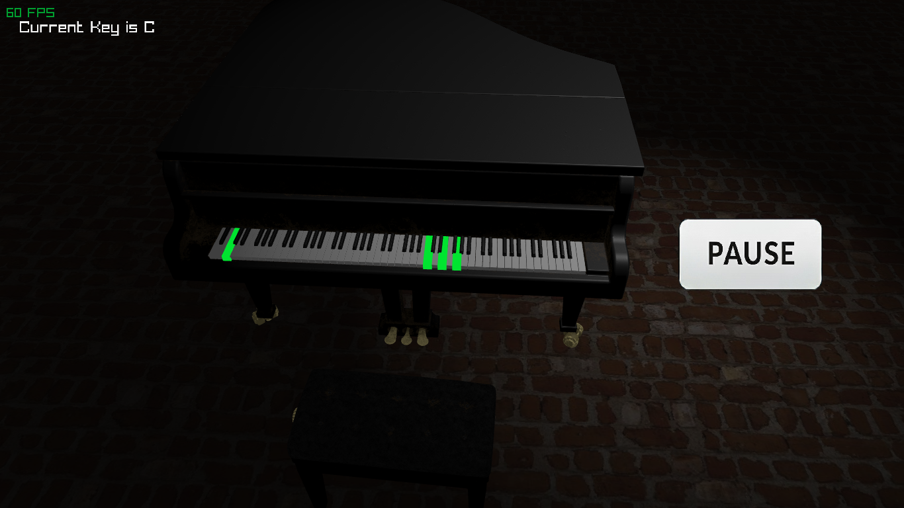

# Ear Trainer 🎹

A comprehensive ear training application written in **C (C11)** using the **raylib** library. The application helps musicians improve aural skills through interactive exercises and a 3D piano interface with dynamic lighting and PBR materials.




---

## Table of Contents

- [Features](#features)
- [Tech Stack](#tech-stack)
- [Project Structure](#project-structure)
- [Getting Started](#getting-started)
  - [Prerequisites](#prerequisites)
  - [Building and Running](#building-and-running)
- [How It Works](#how-it-works)
  - [Screen Management](#screen-management)
  - [Chord Progression Logic](#chord-progression-logic)
  - [3D Rendering](#3d-rendering)
- [License](#license)
- [Acknowledgements](#acknowledgements)

---

## Features

- **Chord Progression Training** — Practice identifying and playing common chord progressions. Progressions are read from `resources/chordprogression.txt` and the app uses intelligent voice leading to transition chords smoothly.
- **Interval Training (WIP)** — A mode for recognizing musical intervals.
- **Free Play Mode** — A 3D piano environment for freely playing chords and melodies.
- **Customizable Sessions** — Select key and scale (Major/Minor) from the settings screen.
- **Interactive 3D Piano** — Keys are highlighted as they are played in a physically rendered 3D piano model.
- **High-Quality Audio** — Pre-recorded piano and bass samples for realistic playback; optional drone notes to support tonal center hearing.
- **PBR Rendering** — Physically Based Rendering shaders for realistic materials and lighting.
- **Background Music Player** — Plays a curated playlist and reads ID3v2 tags (Title, Artist).
- **Smooth UI** — Animated screen transitions and a clean, organized interface.

---

## Tech Stack

- **Language:** C11
- **Framework:** raylib 5.5
- **Graphics:** OpenGL (via raylib), GLSL for custom PBR shaders
- **Data Structures:** `stb_ds.h` (single-file dynamic arrays / hash maps)
- **Audio:** raylib audio module (sample playback & music streaming)

---

## Project Structure

```
ear-trainer/
├── src/
│   └── main.c                  # Entry point, main game loop, and state machine
├── include/
│   ├── ear_trainer.h           # Main header with global definitions and enums
│   ├── chord_screen.c          # Logic for the chord progression training mode
│   ├── chord_parser.c/h        # Parses chord progressions from a text file
│   ├── free_screen.c           # Logic for the free play piano mode
│   ├── home_screen.c           # Main menu logic and UI
│   ├── interval_setting_screen.c # Handles key/scale selection
│   ├── loading_screen.c        # Manages asset loading with a progress animation
│   ├── pause_screen.c          # Pause menu logic
│   ├── draw.c                  # Helper functions for drawing UI elements
│   ├── input.c                 # Abstractions for input handling
│   ├── util.c                  # General utility functions
│   ├── parser.h                # Header for ID3v2 tag parser
│   └── stb_ds.h                # Single-file data structures library
├── resources/
│   ├── audio/                  # Sound effects, instrument samples, and music
│   ├── fonts/                  # Font files
│   ├── images/                 # UI textures and backgrounds
│   ├── models/                 # 3D models in GLTF format
│   ├── shaders/                # GLSL shaders (Vertex and Fragment)
│   ├── textures/               # PBR material textures
│   └── chordprogression.txt    # Definable chord progressions
└── makefile                    # Build script
```

---

## Getting Started

### Prerequisites

- A C compiler (e.g. `gcc` or `clang`).
- `make` for building the project.
- **raylib** (follow the raylib installation guide for your OS).

### Building and Running

```bash
# Clone the repository
git clone https://github.com/your-username/ear-trainer.git
cd ear-trainer

# (Optional) If you have a local copy of raylib, place it in a `lib/` folder
# or ensure the compiler can find raylib headers and libraries.

# Build
make

# Run the executable
./build/ear_trainer
```

> The provided `makefile` assumes raylib is in a standard location (for example `/usr/local/lib`). If raylib is installed in a custom location, update the `CFLAGS`/`LDFLAGS` in the `makefile` accordingly.

---

## How It Works

### Screen Management

A small state machine (managed in `main.c`) handles different application screens such as `HOME_SCREEN` and `CHORD_SCREEN`. The `current_screen` enum tracks the active state. A `screen_transition` flag is used to create smooth animated transitions between screens.

### Chord Progression Logic

- `chord_parser.c` reads progressions from `chordprogression.txt` and converts Roman numeral notation (e.g. `I-V-vi-IV`) into internal chord objects.
- `chord_screen.c` maps chords to actual note values based on the selected key, plays samples, and applies voice-leading using a `TransitionChord`-like function to minimize motion between chord tones.

### 3D Rendering

- The 3D scene is rendered with `BeginMode3D` (raylib).
- Piano model is loaded from a GLTF file in `resources/models/`.
- Custom PBR shaders (e.g. `main_fs.glsl`, `plane_fs.glsl`) use albedo, metallic, roughness, and normal textures to achieve realistic materials.

---

## License

This project is licensed under the **MIT License** — see the `LICENSE` file for details.

---

## Acknowledgements

- **Ramon Santamaria** (@raysan5) and contributors — for the raylib library.
- **Sean Barrett** — for the stb single-file libraries, particularly `stb_ds.h`.
- **Alexey Kutepov** (@rexim)— for C dynamic array.

---

